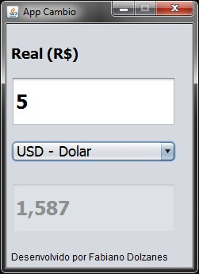

# AppCambio
App Cambio - Java Swing - NetBeans IDE 8.2

	
  
  public class Cambio {

      public double Dolar(double valor) {
          double resultado; 
          resultado = valor / 3.15;
          return resultado;
      }

      public double Euro(double valor) {
          double resultado; 
          resultado = valor / 3.75;
          return resultado;
      }

      public double Iene(double valor) {
          double resultado; 
          resultado = valor * 34.961;
          return resultado;
      }

  }
